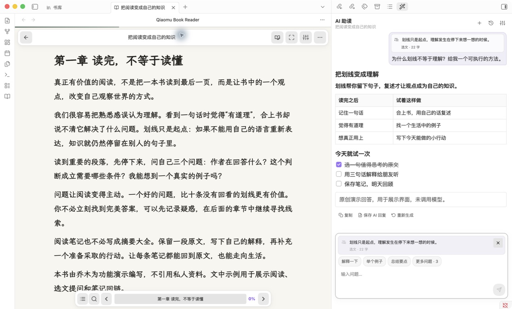
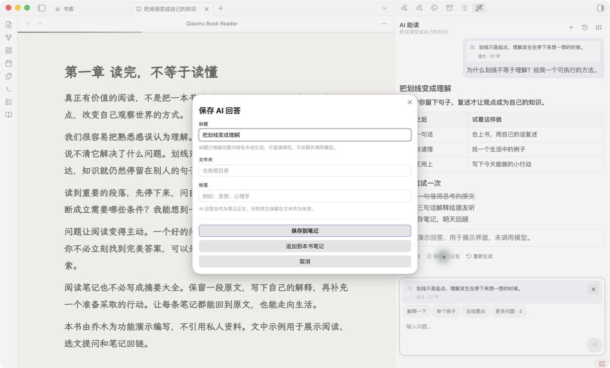
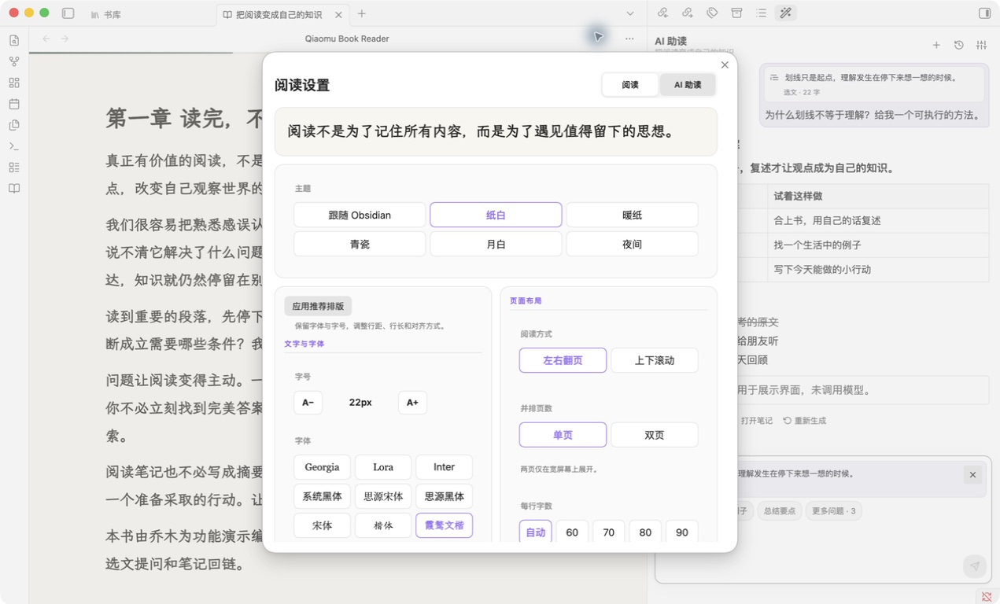
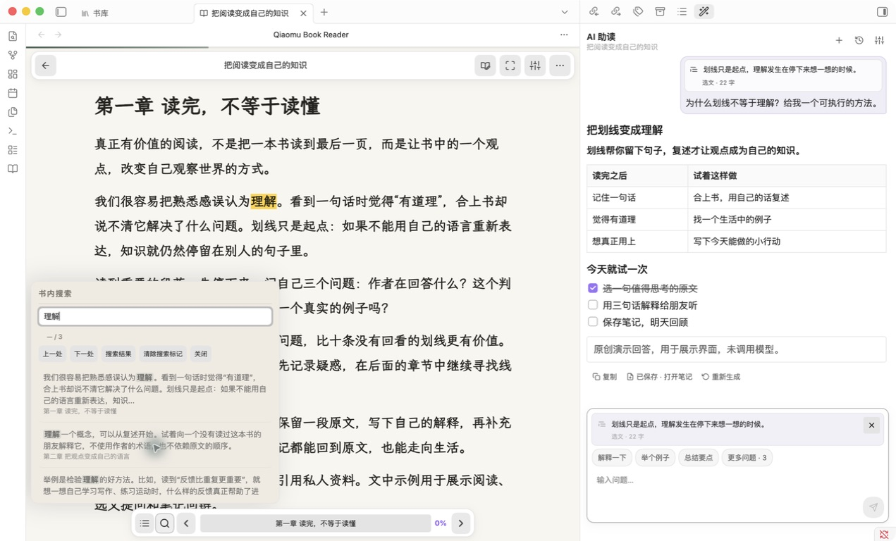
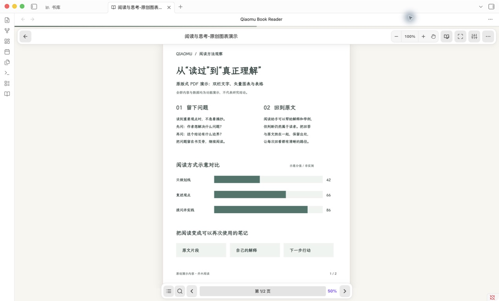
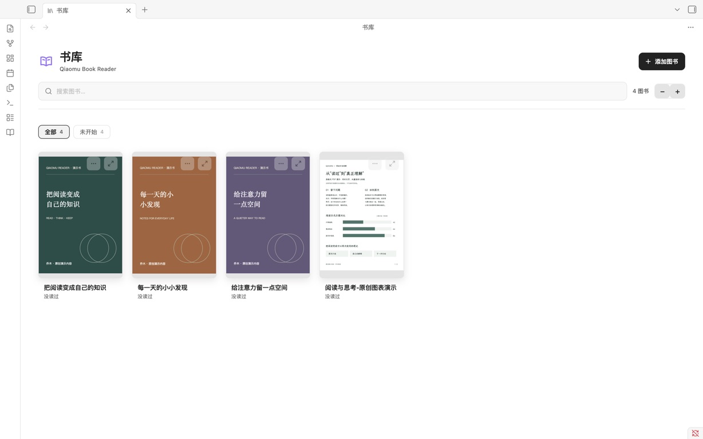

# Qiaomu Book Reader

**中文** · [English](#english) · [下载最新版](https://github.com/joeseesun/qiaomu-book-reader/releases/latest) · [问题反馈](https://github.com/joeseesun/qiaomu-book-reader/issues)

> 不离开书页，读懂一个观点，留下一条真正有用的笔记。
> Read, ask, and keep what matters — without leaving your book in Obsidian.



Qiaomu Book Reader 是中文优先的 Obsidian EPUB、FB2 和 PDF 阅读器。它把**舒适阅读 → 就地提问 → 保存笔记 → 返回原文**放在同一个工作流里，减少在阅读器、聊天窗口和笔记应用之间来回复制。

阅读本身完全离线，每本书关联一篇 Markdown 阅读笔记；AI 是可选能力，由你选择服务并主动启用。

[安装与快速开始](#安装) · [功能导览](#功能导览) · [构建验证](https://github.com/joeseesun/qiaomu-book-reader/actions) · [MIT 许可](LICENSE)

**版本说明：**下面展示的是当前 4.0.1 源码构建，BRAT 和下载版本以 [GitHub Releases](https://github.com/joeseesun/qiaomu-book-reader/releases) 为准。合并 main 不会自动更新已安装插件。尚未上架 Obsidian 社区市场；已向原作者[公开申请 fork 上架授权](https://github.com/swayinfo/elton-reader/issues/14)，仍待回复与后续审核。

截图来自 Computer Use 操作的真实 Obsidian 1.13.7，使用原创演示书和明确标注的示例对话，不含私人仓库或商业书籍页面；示例回答不是模型效果或速度评测。详见[截图与验证说明](docs/showcase.md)。

## 你会得到什么

| 能力 | 实际效果 |
| --- | --- |
| 内置阅读器 | EPUB、FB2 可重排；PDF 保留原页，独立缩放，图表不被拆散 |
| 中文排版 | 内置霞鹜文楷屏幕版、霞鹜臻楷 GB、朱雀仿宋、思源宋体和思源黑体，不依赖系统安装；另有系统黑体、宋体、楷体等选项 |
| 阅读主题 | 纸白、暖纸、青瓷、月白和夜间；只改变书页，工具栏跟随 Obsidian |
| 就近批注 | 选中文字后完成三色划线、复制、评论和创建摘录笔记 |
| 专用阅读笔记 | 每本书自动关联一篇 Markdown 笔记，汇总划线与评论 |
| 精确返回原文 | 笔记中的 `↩` 可跳回原书对应段落 |
| 阅读连续性 | 自动保存位置、可命名位置标记；搜索后能返回原阅读点 |
| 就地 AI 对话 | 阅读和聊天并排；按书管理对话，选文、当前页或文本 PDF 全文作为上下文 |
| 流式 Markdown | 回答边输出边渲染；表格、任务列表、引用、代码块等交给 Obsidian Markdown 渲染器 |
| 回答成为笔记 | 保存完整 AI 回答，本地提取可修改标题；独立保存或追加到本书笔记 |
| 少打断的交互 | 快捷问题直接可见；草稿按书落盘；专注阅读保留右侧 AI，不带回左侧文件树 |
| 自选 AI 服务 | 保留自定义提示词；支持 CLI / ACP、国产模型、OpenAI 兼容接口及本地模型 |

## 功能导览

### 1. 书、问题和想法，留在同一处

上方主图展示阅读区与右侧 AI 助读。选中一句话可以围绕选文追问，不选择时可使用当前页；文本型 PDF 默认使用可提取的整书内容。来源随每条已发送问题保存，翻页或切换书籍不会悄悄改写旧问题的来源。

新建对话、历史搜索和重命名、停止生成、重新生成、复制回答、回到最新消息都保留。常用提示词直接出现在输入框上方，更多自定义问题和 `/` 入口仍可使用。模型配置留在设置里，不占据主要阅读空间。

### 2. 保存的是回答，不是又抄一次原文



回答里的表格、任务列表和完整 Markdown 都进入笔记正文；引用原文放在文末。标题根据内容在本地提取，不增加一次模型调用。保存后继续读、继续聊，需要时再点“已保存 · 打开笔记”；重复点击不重复追加同一回答。

### 3. 让中文长文读起来舒服



五款中文字体随插件提供，不必找字体安装包。主题只改变书页，工具栏跟随 Obsidian；字号、行距、行长与单/双页布局可就近调整。PDF 设置只显示适用的页面与缩放选项，不展示无效的字体重排控件。

### 4. 搜索不打断阅读，找完还能回去



目录、搜索和位置跳转集中在底栏。支持中文单字搜索、结果高亮、`Enter` 下一处、`Shift+Enter` 上一处、`Esc` 关闭。连续查看多个命中仍保留最初的返回点；也可把值得再看的位置保存为可命名标记。

### 5. PDF 保留原版式，图表仍然是图表



PDF 不再被拆成容易错位的普通段落，而是始终保留原始页面：图表、表格、字体和版式由 PDF.js 整页呈现。有可靠文字层的页面会在原页上叠加透明文本层，继续支持选择、复制、搜索、划线、批注和 AI 上下文；扫描页或文字层不可读的页面只提供原页阅读、进度、本书笔记和返回页码，不伪造文字能力。每本 PDF 只使用一份“本书笔记”，不再为每页重复创建笔记入口。一本混合型 PDF 会逐页判断能力。PDF 页面可在 50%–300% 之间缩放，放大后可拖动或滚动查看，原页、文字层和划线会保持对齐。

### 6. 一眼找到书，再接着读



封面书库提供搜索、阅读状态筛选与进度提示。一本书的阅读笔记负责汇总划线和批注；AI 回答可以另存或追加，不需要为 PDF 每页建立一篇笔记。

## 安装

### 使用 BRAT（推荐）

1. 在 Obsidian 第三方插件市场安装 **BRAT**。
2. 打开 BRAT → **Add beta plugin**。
3. 输入 `joeseesun/qiaomu-book-reader`。
4. 在“第三方插件”中启用 **Qiaomu Book Reader**。

之后的新版本会通过 GitHub Releases 由 BRAT 持续更新。

启用后打开“书库”，选择书籍文件夹或添加图书即可开始阅读。先读书无需配置 AI；需要 AI 时再进入插件设置选择服务并测试连接。CLI 模式需自行完成对应 CLI 的安装与登录；模型服务可能收费，遵循所选服务的账号和计费规则。

<details>
<summary>手动安装</summary>

从 [最新版本](https://github.com/joeseesun/qiaomu-book-reader/releases/latest) 下载 `main.js`、`manifest.json` 和 `styles.css`，放入：

```text
<你的仓库>/.obsidian/plugins/qiaomu-book-reader/
```

重新加载 Obsidian 后启用插件。插件 ID 为 `qiaomu-book-reader`。

五款内置中文字体已压缩嵌入 `main.js`，无需再复制字体文件或安装系统字体。朱雀仿宋目前采用上游官方 v0.212 预览测试版，仅作为可选字体提供。

</details>

## AI 辅助阅读

“保存 AI 回复”把完整 Markdown 回答作为笔记正文，原文放在后面的来源区。标题在本地根据回答的主题标题、重点短语或内容句自动提取，过滤“总结”“关键概念”等通用小标题；保存前可修改，不额外调用模型。保存成功后按钮变为“已保存 · 打开笔记”，不会关闭对话，也不会自动抢走阅读焦点。

未发送草稿按书保存在独立本地文件中（最多 30 本、每本最多 20,000 字符），关闭面板或重启后可恢复；生成中输入的新问题不会被上一轮完成动作清掉。插件不主动同步草稿，但第三方同步如果包含整个插件目录，仍可能复制它。新建对话保留当前草稿；已发送的来源固定在对应问题下。单条删除与批量清空都需要确认，删除当前对话后不会在关闭面板时重新写回。

AI 默认关闭。启用后，文本型 PDF 会把整份可提取文字作为新对话的默认上下文；如果选中了原文，则本轮改用选文上下文做精读。常规 PDF 发送全文，超过 180,000 字符时按页均匀精简并明确标注，避免只截掉后半本。你可以通俗解释、举例、提炼要点、联系实际、换角度分析或生成测试题，并继续自由追问。书内“阅读设置”新增“AI 助读”标签，可就近开关 AI、查看当前服务与模型、调节思考模式/强度、回答语言和快捷问题；API 密钥、接口地址等低频敏感配置仍留在插件系统设置。DeepSeek V4 可单独开关思考模式；模型提供思考过程时会单独显示，回答完成后自动折叠，不与正式回答混在一起。

- 本机账号：Codex CLI、Claude Code CLI、Grok CLI、Kimi Code CLI、ZCode CLI。安装并登录一次后，插件可直接复用账号，无需再填 API 密钥。每个 CLI 分别记住自己的模型和思考强度；Grok 的常驻 ACP 会关闭后台自动更新，避免更新进程阻塞首字输出。
- 国产模型：DeepSeek、Kimi、通义千问、智谱 GLM、MiniMax。
- 聚合服务：硅基流动、豆包/火山方舟、OpenRouter。
- 国际服务：OpenAI。
- 本地模型：Ollama、LM Studio。
- 高级配置：任意 OpenAI 兼容接口。

API 密钥保存在 Obsidian 的密钥库中，不会写入插件 `data.json`。设置页可发送一条不含书籍内容的最短消息测试连接。

CLI 模式会自动检测可执行文件和登录状态，在独立临时目录中运行，并拒绝工具、文件和终端权限。Grok 与 Kimi 使用 CLI 自带的 ACP；Codex 使用 [`codex-acp`](https://github.com/agentclientprotocol/codex-acp)，Claude 使用 [`claude-agent-acp`](https://github.com/agentclientprotocol/claude-agent-acp)，ZCode 目前使用社区 [`zcode-acp`](https://github.com/william0wang/zcode-acp)。同一阅读对话复用常驻进程与 ACP session，首轮发送阅读上下文，后续只发送新问题；切换或清空对话会使用新的 session。会话过期或 ACP 进程意外退出且尚未产生回答时，插件会自动重建并安全重试一次；登录、模型、会话和进程故障会分别提示。设置页会区分“原生 ACP”和“需单独安装适配器”，并可分别检测 CLI 与适配器路径。CLI 模式仅支持桌面版 Obsidian。

## 外观与阅读设置

插件设置的“外观”页和书内“阅读设置”使用同一组数据。书内弹窗按任务分为“阅读”和“AI 助读”两个标签；主题、正文字体、字号和行距直接展示，分设备外观、电子墨水屏、对齐、插图和沉浸阅读等低频选项收在“更多阅读设置”中。弹窗只在竖向滚动，并为滚动条预留空间，不再遮住控件。

## 阅读笔记如何工作

首次打开一本书时，插件会创建或关联一份带有 `type: reading-note` 标记的专用 Markdown 笔记。之后的新划线和评论自动汇总到“划线与批注”章节；插件不会仅凭书名误把人物、项目或模板笔记当成阅读笔记。

评论以普通正文显示在引文下方，不使用引用样式。每条引文末尾的 `↩` 是返回原书位置的链接。

## 隐私与联网

书籍、进度、划线、评论和笔记均在本地工作，无需账号，没有遥测、分析或广告。

| 可选功能 | 发送内容 | 目标服务 |
| --- | --- | --- |
| 翻译所选文字 | 当前选中的段落 | Google Translate |
| AI 辅助阅读 | 你主动附加的 PDF 全文、当前页或选中文本、书名和问题 | 你明确选择并配置的模型服务 |
| 本机 CLI 账号 | 你主动附加的 PDF 全文、当前页或选中文本、书名和问题 | Codex、Claude、Grok、Kimi 或 ZCode 的云端服务 |
| 本地 AI | 本轮附加的 PDF 全文、当前页或选文、书名与问题，以及必要的对话历史 | 你配置的 Ollama 或 LM Studio 地址；仅在本机地址且服务不转发时留在设备内 |

两项联网功能均默认关闭。只有在你主动向 AI 提问时，文本型 PDF 才会在该对话首轮发送整书文字上下文；扫描 PDF 不发送页面图片或伪造 OCR 文本。

## 从源码构建

提供独立的[社区市场候选构建](docs/community-release-plan.md)：`npm run build:community` 输出到 `dist/community/`，不包含 ACP 自动安装器，保留手动安装指引、检测和常驻对话能力。当前候选版尚未获得社区审核，也未解决 fork 授权问题；日常安装继续使用上面的 BRAT / Release 入口。

```bash
npm ci
npm test
npm run check:i18n
npx eslint src/
npm run build
npm run verify:release
npm run build:community
```

构建产物是仓库根目录的 `main.js`。五款内置字体的来源、版本与许可见 [fonts/README.md](fonts/README.md) 和 [fonts/OFL.txt](fonts/OFL.txt)。

### 验证与边界

- 当前工作流改造有模块/控制器测试、国际化检查、ESLint、标准及社区候选构建校验；真实桌面 Obsidian 验证覆盖阅读、搜索、回答保存和 PDF 缩放。详见[开发与验收记录](docs/reading-workflow-plan.md)。
- CLI / ACP 仅限桌面；移动真机触控与软键盘仍待专项验证，桌面窄窗口不等于移动端验收。
- 不内置 OCR，不承诺扫描 PDF 可以文字问答；不提供跨书语义检索，也不授予阅读 Agent 文件/终端工具权限。
- 持久 ACP 会话减少重复启动开销，但首字速度仍受 CLI、模型、网络和上下文长度影响，目前没有可公开比较的性能基准。
- 社区候选版不包含自动安装器，但这不等于已满足全部上架要求。授权、兼容性审查与正式审核仍需完成。

## 鸣谢与项目来源

Qiaomu Book Reader 起源于 MIT 开源项目 [swayinfo/elton-reader](https://github.com/swayinfo/elton-reader)。感谢 Elton Reader 原作者 Elton Labs 及所有贡献者打下的阅读器基础，为本项目的持续改造提供了代码基础与启发。

当前仓库是由向阳乔木独立维护的长期 fork，已使用独立的插件 ID、发布渠道和产品名称，并持续围绕中文界面、中文阅读排版、阅读笔记与 AI 辅助阅读进行开发。原始版权声明和第三方许可信息保留在 [LICENSE](LICENSE) 与 [NOTICE.md](NOTICE.md) 中。

## 作者

Qiaomu Book Reader 由 [向阳乔木](https://qiaomu.ai) 维护：

- X：[@vista8](https://x.com/vista8)
- GitHub：[@joeseesun](https://github.com/joeseesun)
- 乔木推荐：[tuijian.qiaomu.ai](https://tuijian.qiaomu.ai)

第三方开源软件、上游来源和版权声明见 [NOTICE.md](NOTICE.md) 与 [LICENSE](LICENSE)。

---

<a name="english"></a>

# English

Qiaomu Book Reader is a Chinese-first EPUB, FB2 and PDF reader for Obsidian. PDF files retain their original fixed page layout; pages with a reliable text layer support selection, search, highlights, annotations and full-document or selected-text AI context, while scan-only pages provide original-page reading, progress and one book-level note without pretending OCR is available. The plugin keeps one dedicated Markdown reading note per book inside your vault.

### A reading workflow, not just a chat window

The screenshots above follow six everyday tasks: **read and ask side by side; save the complete answer; tune Chinese typography; search without losing your place; inspect original PDF pages; find a book and resume.** They were captured from real Obsidian 1.13.7 using original sample books and explicitly labeled, seeded demonstration replies. No private vault content is shown, and these are not model-quality or latency benchmarks.

- Streamed answers render as Markdown while arriving, including tables, task lists, blockquotes and code blocks through Obsidian's renderer.
- Quick prompts remain visible; custom prompts and the `/` entry point are retained.
- Named reading bookmarks, bottom navigation, Chinese single-character search and a return point support continuity.
- Focused reading keeps an already-open AI sidebar without reopening the file tree.
- Chats are associated with books, with searchable/renameable history and immutable source context on sent questions.

Install it with BRAT using `joeseesun/qiaomu-book-reader`, or download `main.js`, `manifest.json`, and `styles.css` from the [latest release](https://github.com/joeseesun/qiaomu-book-reader/releases/latest).

Reading works fully offline. In-reader settings are split into Reading and AI Assistance tabs, keeping frequent AI controls close to the book while API keys and endpoint URLs remain in Obsidian plugin settings. Optional AI reading assistance includes editable quick prompts and supports signed-in Codex CLI, Claude Code CLI, Grok CLI, Kimi Code CLI, and ZCode CLI accounts without additional API-key setup, plus DeepSeek, Kimi, Qwen, GLM, MiniMax, SiliconFlow, Doubao, OpenRouter, OpenAI, Ollama, LM Studio, and custom OpenAI-compatible endpoints. CLI chats use persistent ACP sessions: Grok and Kimi provide ACP natively, while Codex, Claude, and ZCode use separately installed adapters. If an ACP session expires or its process exits before returning any content, the plugin rebuilds it and retries once; authentication, model, session, and process failures are reported separately. Grok ACP is launched with background auto-update disabled so an updater cannot delay the first streamed token. CLI providers are desktop-only and still send the page or selection you explicitly attach to their cloud service. AI is off by default and keys are stored with Obsidian SecretStorage.

Saving an AI reply preserves its complete Markdown body with the source below it, either in a separate note or appended to the book's reading note. An editable title is extracted locally from the reply's topic, emphasis or content, with no extra model request. Saving keeps the chat open, and the saved action opens the existing note. Unsent drafts are persisted locally for up to 30 books (20,000 characters each) and survive sidebar closure/restarts; third-party syncing of the plugin folder may also copy them. Deleting conversations requires confirmation. These 4.0.1 source changes are separate from the latest GitHub Release used by BRAT.

### Verification and limits

Use `npm ci`, `npm test`, `npm run check:i18n`, `npx eslint src/`, `npm run build`, `npm run verify:release`, and `npm run build:community` to reproduce the automated gates. See [screenshot evidence](docs/showcase.md) and [workflow checks](docs/reading-workflow-plan.md). Physical mobile-device validation is pending. There is no built-in OCR or cross-book semantic search. CLI providers are desktop-only; model costs and terms belong to the selected provider. Local-model requests stay on-device only when the configured endpoint is local and does not forward them. Persistent ACP reduces repeated startup work, but no comparative latency benchmark is claimed.

## Acknowledgements and provenance

A separate community-candidate build is available with `npm run build:community` in `dist/community/`. It excludes the ACP dependency installer while retaining manual setup guidance, detection, and persistent chat. This candidate is not approved for the directory and does not resolve the upstream-fork permission requirement. See the [release boundaries and rewrite plan](docs/community-release-plan.md).

Qiaomu Book Reader began as a fork of the MIT-licensed [swayinfo/elton-reader](https://github.com/swayinfo/elton-reader) project. We thank the original Elton Reader author, Elton Labs, and every contributor whose work provided the technical foundation and inspiration for this project.

This repository is now an independently maintained long-term fork with its own plugin ID, release channel, and product name. Original copyright notices and third-party license information remain in [LICENSE](LICENSE) and [NOTICE.md](NOTICE.md).

We have [publicly requested the upstream author's permission](https://github.com/swayinfo/elton-reader/issues/14) to submit this fork to the Obsidian community directory. The request is pending; neither upstream authorization nor directory approval is being claimed.

Maintained by [Qiaomu](https://qiaomu.ai). Third-party notices and upstream attribution are preserved in [NOTICE.md](NOTICE.md) and [LICENSE](LICENSE).

## License

[MIT](LICENSE)
